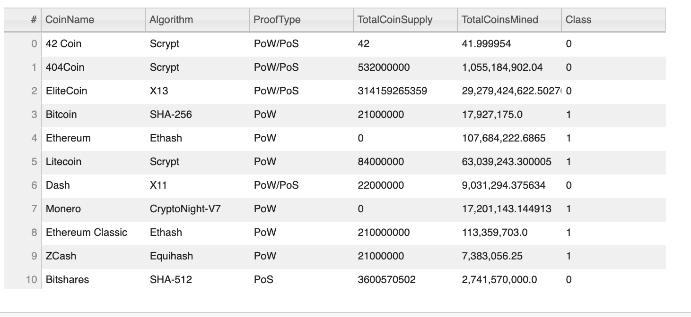

# Cryptocurrencies

## Background
Martha is a senior manager for the Advisory Services Team at Accountability Accounting, one of your most important clients. Accountability Accounting, a prominent investment bank, is interested in offering a new cryptocurrency investment portfolio for its customers. The company, however, is lost in the vast universe of cryptocurrencies. So, they’ve asked you to create a report that includes what cryptocurrencies are on the trading market and how they could be grouped to create a classification system for this new investment.

The data Martha will be working with is not ideal, so it will need to be processed to fit the machine learning models. Since there is no known output for what Martha is looking for, she has decided to use unsupervised learning. To group the cryptocurrencies, Martha decided on a clustering algorithm. She’ll use data visualizations to share her findings with the board.

## Purpose
To create a report ,using machine learning models,that includes what cryptocurrencies are on the trading market and how they could be grouped to create a classification system for this new investment.

## Overview

- Deliverable 1: Preprocessing the Data for PCA
- Deliverable 2: Reducing Data Dimensions Using PCA
- Deliverable 3: Clustering Cryptocurrencies Using K-means
- Deliverable 4: Visualizing Cryptocurrencies Results

## Clustering Cryptocurrencies Using K-means - Elbow Curve

## Visualizing Cryptocurrencies Results

## 3D-Scatter plot

## 2D-Scatter plot

## Tradable Cryptocurrencies Table

## Summary

We have identified 532 tradable crytocurrencies by clustering based on mean,max,min,standard deviation and other similarities of their features. However, it would be best to analyze each cluster to better understand the potential of each cryptocurrency.
